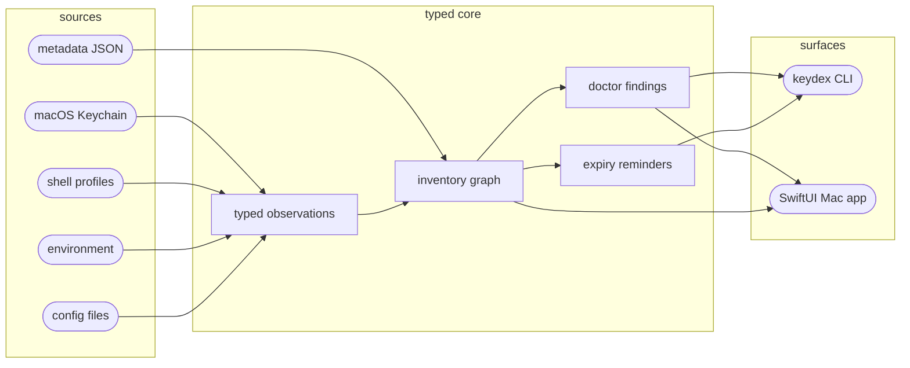

# Keydex

[](https://github.com/jazz1x/keydex/actions/workflows/guard.yml)
[](https://github.com/jazz1x/keydex/actions/workflows/security.yml)


**Keydex tells the truth about where your developer credentials live.** It inventories
macOS Keychain items, shell profiles, environment variables, and local config files, then
shows which credentials are registered, missing, duplicated, orphaned, expiring, or still
falling back to plaintext. **No secret values stored. No vault. Just the map.**

```bash
git clone https://github.com/jazz1x/keydex.git
cd keydex
swift run keydex --help
swift run keydex list --metadata Tests/Fixtures/metadata.json
swift run keydex reminders --metadata Tests/Fixtures/metadata.json --now 2026-07-01
```

Or run the local gates:

```bash
make guard
make quality
make release-smoke
```

> Requires **macOS 15+**, **Swift 6.0+**, Xcode Command Line Tools, `make`, and `rg`
> for the quality scripts. Release smoke also uses macOS signing/image tools such as
> `codesign`, `plutil`, `hdiutil`, `tar`, and `shasum`.

First-run success means:

- `swift run keydex --help` lists `list`, `where`, `doctor`, `reminders`, and `scan`.
- `swift run keydex list --metadata Tests/Fixtures/metadata.json` prints fixture
  credentials with status symbols and without secret values.
- `swift run keydex reminders --metadata Tests/Fixtures/metadata.json --now 2026-07-01`
  reports the expired fixture reminder.
- `make guard` passes format, tests, app build, and forbidden-pattern checks.
- `make quality` passes command inventory, docs drift, loop contract, project contract, CLI smoke,
  accessibility contract, and design contract checks.

---

## What it does

1. **Inventories credential sources** - Keychain, environment variables, shell profiles,
   and config files become typed observations.
2. **Reconciles registered vs live state** - metadata references are compared with live
   Keychain observations so missing and orphaned items become visible.
3. **Explains unhealthy states** - doctor findings include severity, cause, and action.
4. **Tracks expiry metadata** - `expiresAt` and `notifyBeforeDays` produce scheduled, due,
   and expired reminder states without storing secrets.
5. **Keeps CLI and Mac app aligned** - both surfaces are backed by the same domain labels,
   graph projection, and design contracts.

Keydex deliberately does not become a password manager. Secret values stay in Keychain or
another explicit secret store. Keydex owns references, metadata, graph edges, and findings.

---

## Inventory flow

Credential data moves one way: source parsing creates observations, reconciliation builds
the graph, doctor/reminder logic projects actionable state, and CLI/UI display the result.



- **Source boundary** - raw strings are parsed once into typed services, accounts,
  locations, and states.
- **Graph boundary** - `registered`, `missing-keychain-item`, `orphan`,
  `plaintext-fallback`, `duplicate`, `expiring`, and `expired` are facts to show, not
  shortcuts to hide.
- **Secret boundary** - metadata and fixtures never store credential values.

---

## Metadata

Metadata is safe-to-commit inventory data. It points at secret stores and records operating
facts such as owner, purpose, expiry, and notification lead time.

```json
{
  "credentials": [
    {
      "id": "aws/jongyun",
      "service": "aws",
      "account": "jongyun",
      "state": "registered",
      "locations": [
        {
          "kind": "keychain",
          "service": "aws",
          "account": "jongyun"
        }
      ],
      "expiresAt": "2026-01-01",
      "notifyBeforeDays": 30
    }
  ]
}
```

Rules:

- `expiresAt` uses `YYYY-MM-DD`.
- `notifyBeforeDays` requires `expiresAt` and must be zero or greater.
- `locations[].kind = "keychain"` is reconciled against live Keychain only when
  `--include-keychain` is passed.
- Metadata stores references and state, never the secret value.

---

## Commands

CLI output follows [CLI-INTERFACE.md](docs/CLI-INTERFACE.md): `◇` for command summaries
and informational states, `✓` for clean/registered, `⚠` for warnings, `■` for errors,
and bracket scopes such as `[graph]`, `[env]`, `[shell]`, and `[keychain]` under a `│`
detail rail.
ANSI color is TTY-only and respects `NO_COLOR`.

| Command | Description |
| --- | --- |
| `swift run keydex list` | List indexed credentials. |
| `swift run keydex list --metadata PATH` | List metadata-backed credentials. |
| `swift run keydex list --metadata PATH --include-keychain` | Reconcile metadata with live Keychain observations. |
| `swift run keydex where SERVICE` | Show where a credential resolves from. |
| `swift run keydex doctor` | Diagnose inventory drift. |
| `swift run keydex doctor --metadata PATH --include-keychain` | Diagnose metadata vs live Keychain drift. |
| `swift run keydex reminders --metadata PATH` | Show configured expiry reminders. |
| `swift run keydex reminders --metadata PATH --now YYYY-MM-DD` | Run reminder planning at a fixed date for deterministic checks. |
| `swift run keydex scan env` | Scan process environment names for credential hints. |
| `swift run keydex scan shell` | Scan shell profile files for credential hints. |
| `swift run keydex scan config --path PATH` | Scan one config file for credential hints. |
| `swift run keydex scan keychain` | Scan live macOS Keychain references. |
| `swift run KeydexApp` | Launch the SwiftUI Mac app from SwiftPM. |

### Reconciliation example

```bash
swift run keydex doctor \
  --metadata Tests/Fixtures/metadata.json \
  --include-keychain
```

When live Keychain scanning is enabled:

- matched metadata-Keychain pairs become `registered`
- metadata references that point at nothing become `missing-keychain-item`
- live Keychain references with no metadata become `orphan`

### Reminder example

```bash
swift run keydex reminders \
  --metadata Tests/Fixtures/metadata.json \
  --now 2026-07-01
```

Expected fixture output:

```text
■ expired: aws/jongyun expires 2026-01-01
│  notify: 2025-12-02 (30d before)
```

---

## Mac app

The app is native SwiftUI. It is built as a SwiftPM executable product:

```bash
swift build --product KeydexApp
swift run KeydexApp
```

Design rules live in docs and scripts rather than screenshots alone:

- [DESIGN-FOUNDATION.md](docs/DESIGN-FOUNDATION.md) - product and visual principles
- [DESIGN-SYSTEM.md](docs/DESIGN-SYSTEM.md) - native controls, Liquid Glass hierarchy,
  inventory tables/cards, and no-theater rules
- [SCREEN-VALIDATION.md](docs/SCREEN-VALIDATION.md) - screenshot and accessibility evidence
- `make app-design-contract` - source-level design drift guard
- `make app-ux-flow-contract` - daily inventory UX flow drift guard
- `make app-accessibility-contract` - accessibility identifier/label guard

---

## Development guardrails

| Gate | What it checks |
| --- | --- |
| `make guard` | Swift format, tests, app build, forbidden patterns. |
| `make quality` | CLI inventory drift, state/docs drift, loop contract, project contract, CLI smoke, app design/accessibility/UX flow contracts. |
| `make loop-contract` | Clean Architecture import boundaries, package dependency boundaries, and loop documentation wiring. |
| `make release-smoke` | Release payload, CLI smoke artifact, ad-hoc app signing, archive, checksum, and DMG verification. |
| `make release-signing-readiness` | Developer ID / notarization readiness evidence. |
| `make evidence-status` | Current local evidence status, including pending manual accessibility and blocked Developer ID signing prerequisites. |
| `pre-commit run --all-files` | Local hook suite before commit. |

CI runs `guard`, `quality`, `release-smoke`, `gitleaks`, and `trivy`. The protected
`main` branch accepts squash merges only after required checks pass.

---

## Philosophy

Keydex follows one rule first: **state must not lie**.

- [PHILOSOPHY.md](docs/PHILOSOPHY.md) - state honesty, typed flow, restraint
- [GOALS.md](docs/GOALS.md) - product goals, non-goals, milestones, completion gates
- [PRODUCT-PLAN.md](docs/PRODUCT-PLAN.md) - total goal answers and milestone evidence
- [FEATURE-SPEC.md](docs/FEATURE-SPEC.md) - feature behavior and acceptance criteria
- [CLI-INTERFACE.md](docs/CLI-INTERFACE.md) - status symbols, scope labels, and color rules
- [VALIDATION-SCENARIOS.md](docs/VALIDATION-SCENARIOS.md) - functional validation scenarios
- [SCREEN-VALIDATION.md](docs/SCREEN-VALIDATION.md) - screenshot and accessibility evidence
- [GRAPH-WORKFLOW.md](docs/GRAPH-WORKFLOW.md) - graph traversal and workflow contract
- [LOOP-CONTRACT.md](docs/LOOP-CONTRACT.md) - quality loop, architecture boundary, and evidence contract
- [ENFORCEMENT.md](docs/ENFORCEMENT.md) - guardrail policy
- [VERIFICATION.md](docs/VERIFICATION.md) - verification surfaces
- [TESTING-STRATEGY.md](docs/TESTING-STRATEGY.md) - test pyramid and boundary rules

Non-goals:

- Do not build a vault.
- Do not sync secrets.
- Do not copy 1Password, Bitwarden, or Apple Passwords.
- Do not invent team administration before the personal Mac workflow is true.
- Do not make copying secrets the primary UX.

---

## Release

The current release smoke path produces a local payload, `.tar.gz`, checksum, and `.dmg`:

```bash
make release-smoke
```

Known limits are explicit:

- app bundle is signed ad-hoc for smoke verification
- DMG is unsigned
- Developer ID signing and notarization remain future gates

Readiness docs:

- [RELEASE-READINESS.md](docs/RELEASE-READINESS.md)
- [RELEASE-CANDIDATE.md](docs/RELEASE-CANDIDATE.md)
- [SIGNING-NOTARIZATION.md](docs/SIGNING-NOTARIZATION.md)

---

## Troubleshooting

| Symptom | Fix |
| --- | --- |
| `swift run keydex --help` fails | Check Xcode Command Line Tools and Swift version with `swift --version`. |
| `make guard` fails at format | Run `/Library/Developer/CommandLineTools/usr/bin/swift-format format --recursive --in-place Package.swift Sources Tests Apps`, then rerun the gate. |
| `scan keychain` returns less than expected | Keydex only sees Keychain items visible to the current macOS user and access policy. |
| `--include-keychain` marks metadata as missing | The metadata service/account pair does not match a live Keychain item. Fix the metadata reference or create the item in Keychain. |
| `notifyBeforeDays` is rejected | Add a valid `expiresAt` date first, then use a non-negative lead day count. |
| `make release-smoke` fails on signing/image tools | Confirm `codesign`, `plutil`, and `hdiutil` are available on macOS. |

---

## Directory

```text
keydex/
├─ Apps/
│  └─ KeydexApp/             # SwiftUI Mac app
├─ Sources/
│  ├─ KeydexCore/            # typed domain, graph, doctor, reminders
│  ├─ KeydexKeychain/        # macOS Security framework scanner
│  ├─ KeydexSources/         # env, shell, config scanners
│  ├─ KeydexStore/           # metadata store
│  └─ keydex/                # CLI entry point
├─ Tests/
│  ├─ Fixtures/              # safe metadata/config fixtures
│  ├─ KeydexCoreTests/
│  ├─ KeydexKeychainTests/
│  ├─ KeydexSourcesTests/
│  └─ KeydexStoreTests/
├─ docs/                     # goals, philosophy, design, UX flow, validation, release docs
├─ scripts/                  # guard, quality, release, design/accessibility contracts
├─ Package.swift
└─ Makefile
```
